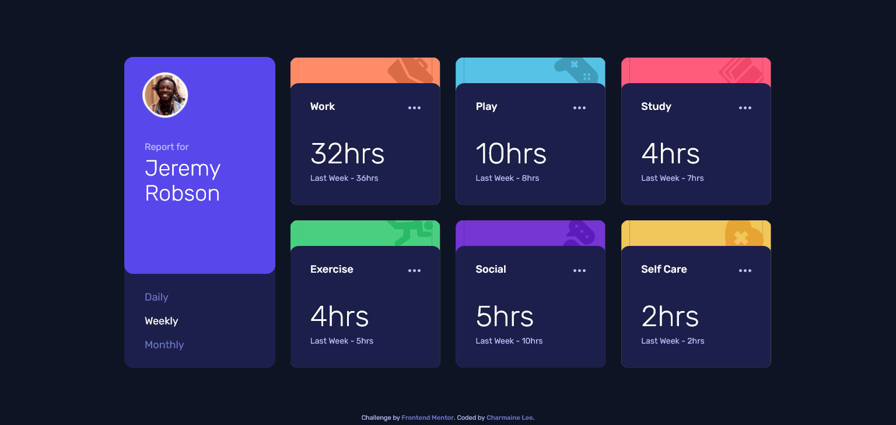

# Frontend Mentor - Time tracking dashboard solution

This is a solution to the [Time tracking dashboard challenge on Frontend Mentor](https://www.frontendmentor.io/challenges/time-tracking-dashboard-UIQ7167Jw). Frontend Mentor challenges help you improve your coding skills by building realistic projects.

## Table of contents

- [Overview](#overview)
  - [The challenge](#the-challenge)
  - [Screenshot](#screenshot)
  - [Links](#links)
- [My process](#my-process)
  - [Built with](#built-with)
  - [Useful resources](#useful-resources)
- [Author](#author)

## Overview

### The challenge

Users should be able to:

- View the optimal layout for the site depending on their device's screen size
- See hover states for all interactive elements on the page
- Switch between viewing Daily, Weekly, and Monthly stats

### Screenshot

### Links

- Solution URL: [Frontend Mentor Solution Page](https://www.frontendmentor.io/solutions/responsive-time-tracking-dashboard-using-css-grid-HJizBu04q)
- Live Site URL: [Time-tracking Dashboard](https://fmc-time-tracking-dashboard.netlify.app/)

## My process

### Built with

- Semantic HTML5 markup
- CSS custom properties
- Flexbox
- CSS Grid
- Mobile-first workflow

### Useful resources

- [Restricting element to its parent's border-box](https://css-tricks.com/restricting-a-pseudo-element-to-its-parents-border-box/) -Teaches how overflowing object can be clipped within the boundaries of the parent element, inclusive of the border

## Author

- Website - [Charmaine Lee](https://charmainelhm.netlify.app/)
- Frontend Mentor - [@charmainelhm](https://www.frontendmentor.io/profile/charmainelhm)
- Twitter - [@noodercob_ie](https://www.twitter.com/noodercob_ie)
